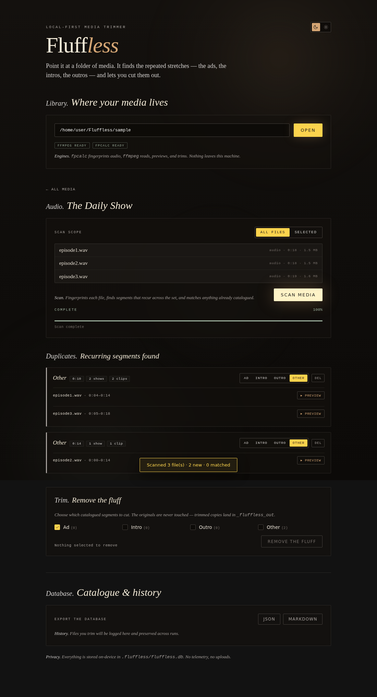

# Fluffless

*A tool to remove the fluff.* Point it at a folder of media, and it finds the
stretches that **repeat** — the ads, the intros, the outros — lets you preview
and catalogue them, then trims them out. The originals are never touched; the
catalogue is preserved so you can keep adding files to the same folder and run
again.

It is **local-first**: a small Python server (stdlib only) binds to
`127.0.0.1`, fingerprints with **fpcalc** and cuts with **ffmpeg**, and stores
everything on-device in a SQLite database. No accounts, no uploads, no
telemetry.



---

## How it works

The hard part — *finding the same audio in two files even though it sits at a
different offset and was re-encoded so it's never byte-identical* — is a
fingerprint-alignment problem:

1. **Fingerprint.** Each file becomes a fixed-rate stream of integers
   (Chromaprint for audio, ~8/s; perceptual frame hashes for video, a few/s).
2. **Align & verify.** For each pair of files, candidate offsets are seeded
   with a vote histogram, then verified item-by-item with **Hamming distance**
   (two items "match" if they differ by ≤ 8 of 32 bits — re-encoding flips only
   a handful; unrelated audio differs by ~half).
3. **Recur.** A position is interesting when it's covered in enough *other*
   files. Contiguous runs (gap-bridged, density-checked) become timestamped
   segments.
4. **Remember.** A found segment is stored as a **pattern** (its fingerprint
   slice + a label). A single new file can then be trimmed on its own by
   locating that stored pattern inside it — no peers required.

The matcher is deliberately **fingerprint-agnostic**, so the identical
alignment / recurrence / timestamp code serves both audio and video. The full
algorithm and its tuning dials are documented in
[`docs/Pattern_Detection.md`](docs/Pattern_Detection.md).

---

## The workflow

| Step | What happens |
| :-- | :-- |
| **Open a library** | A root folder of show folders. Each is shown as a card with an **audio** or **video** logo and a file count. |
| **Pick a folder, choose scope** | Scan **all** files (default) or a **selected** subset. |
| **Scan** | Fingerprints the files, finds recurring segments, matches anything already catalogued, extracts a previewable clip for each, and stores it all. A **live progress tracker** streams the current file, percent complete, and a time-remaining estimate over Server-Sent Events — built for batches of "a ton of media". |
| **Review duplicates** | Each pattern is a row you can **preview** (in-tool playback) as many times as needed, then **catalogue** as `Ad`, `Intro`, `Outro`, or `Other`. |
| **Remove the fluff** | Choose which labels to cut (default `Ad`; add `Intro`/`Outro`/`Other`). Trimmed copies are written to `_fluffless_out/`; originals and the catalogue are preserved. |
| **Export** | The whole database exports to **JSON** (round-trippable) or **Markdown** (inspectable backup). |

Because the catalogue and the processed-file log persist, a folder is a living
workspace: drop in new episodes, re-scan, and known intros/ads are matched
automatically while genuinely new patterns get logged.

---

## Requirements

- **Python 3.11+** (standard library only — no `pip install` needed).
- **ffmpeg** + **ffprobe** — reading metadata, extracting previews, trimming.
- **fpcalc** (Chromaprint) — audio fingerprinting.

```bash
# Debian/Ubuntu
sudo apt-get install ffmpeg libchromaprint-tools
# macOS
brew install ffmpeg chromaprint
```

Fluffless runs without the binaries too — it just reports them as missing and
disables the steps that need them.

---

## Running it

```bash
# Try the demo: generate a sample library, then open it
./sample/generate_sample.sh
python3 -m fluffless ./sample

# Or point it at your own media
python3 -m fluffless "/path/to/your/media" --port 7654

# Control parallelism (defaults to your CPU core count; 1 disables it)
python3 -m fluffless "/path/to/your/media" --workers 8
```

Then open <http://127.0.0.1:7654>. With no path, Fluffless opens
`~/Fluffless Media` if it exists (override with `$FLUFFLESS_LIBRARY`).

Scanning runs in parallel: fingerprinting (fpcalc/ffmpeg subprocesses) across
threads and the `O(N²)` cross-file detection across worker processes. `--workers`
defaults to the number of CPU cores; if a worker pool can't start it falls back
to single-process automatically.

---

## Design language

The interface is **"Editorial Dusk & Dawn"** — a warm, literary aesthetic in
two themes that share one set of semantic tokens: serif display type, sans
body, mono for data, `2px` corners, translucent panels over a triple-glow
background. Dusk is a late-night reading room; Dawn is the same on warm paper
cream. Full reference: [`docs/style.md`](docs/style.md).

---

## Layout

```
fluffless/
  repetition.py   the detection engine (fingerprint-agnostic matcher)
  fingerprint.py  audio (fpcalc) + video (frame dHash) extractors
  media.py        scan a library into audio/video media folders
  scan.py         orchestrate: fingerprint -> detect -> match -> store
  clips.py        extract preview clips & trim segments (ffmpeg)
  db.py           SQLite storage + JSON/Markdown export
  binaries.py     locate & run ffmpeg / ffprobe / fpcalc
  server.py       stdlib HTTP server: JSON API + range media streaming
  __main__.py     CLI entry point
web/              the self-contained "Editorial Dusk & Dawn" UI
tests/            deterministic engine, storage, and media tests
docs/             Pattern_Detection.md - style.md
```

## Tests

```bash
python3 run_tests.py          # stdlib runner, no dependencies
# or, if you have pytest:
pytest tests/
```

The engine tests use synthetic integer fingerprints with controlled bit-flips,
so the alignment, recurrence, and run-extraction logic is verified exactly,
independent of any audio codec.
